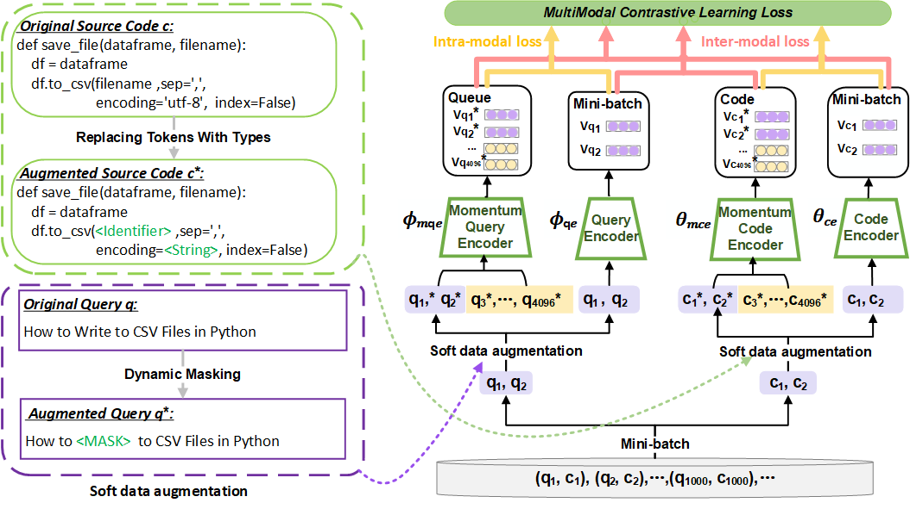

# CoCoSoDa: Effective Contrastive Learning for Code Search

Our approach adopts the pre-trained model as the base code/query encoder and optimizes it using multimodal contrastive learning and soft data augmentation.



CoCoSoDa is comprised of the following four components:
* **Pre-trained code/query encoder** captures the semantic information of a code snippet or a natural language query and maps it into a high-dimensional embedding space. 
as the code/query encoder.
* **Momentum code/query encoder** encodes the samples (code snippets or queries) of current and previous mini-batches to enrich the negative samples.

* **Soft data augmentation** is to dynamically mask or replace some tokens in a sample (code/query) to generate a similar sample as a form of data augmentation.

* **Multimodal contrastive learning loss function** is used as the optimization objective and consists of inter-modal and intra-modal contrastive learning loss. They are used to minimize the distance of the representations of similar samples and maximize the distance of different samples in the embedding space.


## Source code 
### Environment
```
conda create -n CoCoSoDa python=3.6 -y
conda activate CoCoSoDa
pip install torch==1.10  transformers==4.12.5 seaborn==0.11.2 fast-histogram nltk==3.6.5 networkx==2.5.1 tree_sitter tqdm prettytable gdown more-itertools tensorboardX sklearn  
```
### Data

```
cd dataset
bash get_data.sh 
```

Data statistic is shown in this Table. 

| PL         | Training | Validation  |  Test  | Candidate Codes|
| :--------- | :------: | :----: | :----: |:----: |
| Ruby       |  24,927  | 1,400  | 1,261  |4,360|
| JavaScript |  58,025  | 3,885  | 3,291  |13,981|
| Java       | 164,923  | 5,183  | 10,955 |40,347|
| Go         | 167,288  | 7,325  | 8,122  |28,120|
| PHP        | 241,241  | 12,982 | 14,014 |52,660|
| Python     | 251,820  | 13,914 | 14,918 |43,827|

It will take about 10min.

### Training and Evaualtion

We have uploaded the pre-trained model to  [huggingface](https://huggingface.co/). You can directly download [DeepSoftwareAnalytics/CoCoSoDa](https://huggingface.co/DeepSoftwareAnalytics/CoCoSoDa) and fine-tune it. 
#### Pre-training (Optional)

```
bash run_cocosoda.sh $lang 
```
The optimized model is saved in `./saved_models/cocosoda/`. You can upload them to [huggingface](https://huggingface.co/).

It will take about 3 days.

#### Fine-tuning


```
lang=java
bash run_fine_tune.sh $lang 
```

### Results	

#### The Model Evaluated with MRR 

| Model          |   Ruby    | Javascript |    Go     |  Python   |   Java    |    PHP    |  Avg.  |
| -------------- | :-------: | :--------: | :-------: | :-------: | :-------: | :-------: | :-------: |
| CoCoSoDa | **0.818**| **0.764**| **0.921** |**0.757**| **0.763**| **0.703** |**0.788**|

## Appendix

The description of baselines, addtional experimetal results and discussion are shown in `Appendix/Appendix.pdf`. 
